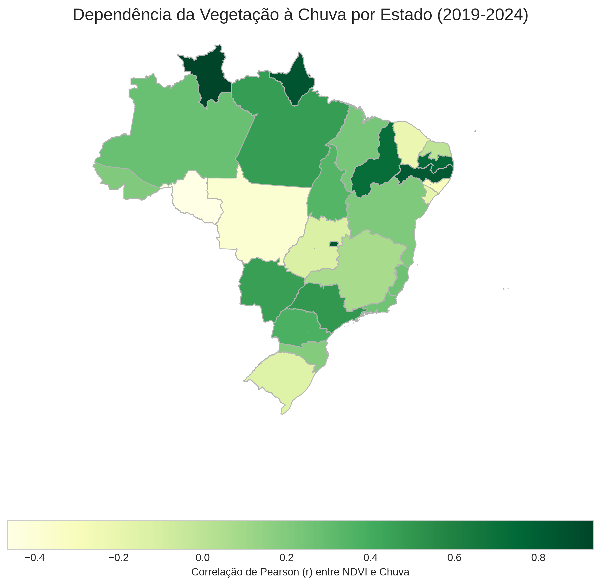

# Análise Espaço-Temporal da Dinâmica Ambiental no Brasil (2019-2024)

Este repositório contém o pipeline computacional completo para uma análise geoespacial e de séries temporais da dinâmica ambiental do Brasil, utilizando dados de satélite públicos da NASA. O projeto integra dados de vegetação (NDVI), clima (Temperatura da Superfície e Pluviosidade) e aplica técnicas de estatística, Machine Learning e Deep Learning para identificar tendências, anomalias e padrões de mudança no período de 2019 a 2024.

---

## Índice

- [Visão Geral do Projeto](#-visão-geral-do-projeto)
  - [Motivação](#motivação)
  - [Objetivos](#objetivos)
  - [Tecnologias Utilizadas](#tecnologias-utilizadas)
- [Estrutura do Repositório](#-estrutura-do-repositório)
- [Guia de Instalação e Execução](#-guia-de-instalação-e-execução)
  - [Pré-requisitos](#pré-requisitos)
  - [Passo 1: Clonar o Repositório](#passo-1-clonar-o-repositório)
  - [Passo 2: Configurar o Ambiente Conda (Etapa Crítica)](#passo-2-configurar-o-ambiente-conda-etapa-crítica)
  - [Passo 3: Instalar as Bibliotecas](#passo-3-instalar-as-bibliotecas)
  - [Passo 4: Autenticação e Acordos de Uso da NASA](#passo-4-autenticação-e-acordos-de-uso-da-nasa)
- [Fluxo de Execução dos Scripts](#-fluxo-de-execução-dos-scripts)
- [Principais Análises e Resultados](#-principais-análises-e-resultados)

---

## 🛰️ Visão Geral do Projeto

### Motivação

O Brasil, uma nação megadiversa, abriga biomas críticos para a estabilidade climática global. Esses ecossistemas estão sob crescente pressão de vetores como a expansão agropecuária, urbanização e eventos climáticos extremos. O monitoramento contínuo em escala continental é um desafio imenso, tornando o sensoriamento remoto e a ciência de dados ferramentas indispensáveis para uma análise objetiva e sistemática.

### Objetivos

O objetivo central é caracterizar, quantificar e interpretar a dinâmica ambiental do Brasil (2019-2024), utilizando um framework que integra múltiplos dados e técnicas de análise para inferir os vetores de mudança. Os objetivos específicos incluem:
1.  **Coleta e Processamento Automatizado:** Criar um pipeline robusto para baixar e processar dados de NDVI, Temperatura (LST) e Pluviosidade da NASA.
2.  **Análise de Tendências e Anomalias:** Identificar tendências de longo prazo e anomalias anuais em escala nacional e regional.
3.  **Segmentação por Machine Learning:** Aplicar clusterização K-Means para segmentar o território em zonas climáticas e de vegetação homogêneas.
4.  **Detecção de Mudanças com Deep Learning:** Implementar uma rede neural (ConvLSTM Autoencoder) para detectar hotspots de mudança abrupta na cobertura vegetal.
5.  **Análise de Correlação Integrada:** Investigar a relação entre a saúde da vegetação (NDVI) e os vetores climáticos (LST, Chuva).

### Tecnologias Utilizadas

- **Linguagem:** Python 3.11
- **Gerenciamento de Ambiente:** Conda
- **Bibliotecas Principais:**
  - **Geoespaciais:** `geopandas`, `rasterio`, `h5py`
  - **Dados e Computação:** `pandas`, `numpy`
  - **Deep Learning:** `pytorch`
  - **Machine Learning:** `scikit-learn`
  - **Visualização:** `matplotlib`, `seaborn`
  - **Acesso a Dados:** `earthaccess`
- **Software de Apoio:** QGIS (para inspeção visual dos GeoTIFFs gerados)

---

## 🗂️ Estrutura do Repositório

```
/
|-- 📄 analise_climatica.py        # Script para análises de Temperatura e Chuva
|-- 📄 analise_climatica_integrada.py  # Script final para correlação NDVI x Clima
|-- 📄 analise_NDVI.py                 # Script para análises de NDVI
|-- 📄 coleta_dados_NDVI.py  # Script para baixar dados de NDVI
|-- 📄 coleta_dados_climaticos.py  # Script para baixar dados de LST e Chuva
|-- 📄 neural_analise.py           # Script para análise com Rede Neural
|-- 📄 processa_dados_climaticos.py # Script para processar dados de LST e Chuva
|-- 📁 dados_pluviosidade/          # Armazena dados brutos de chuva (GPM)
|-- 📁 dados_temperatura/          # Armazena dados brutos de temperatura (MODIS)
|-- 📁 dados_satelite/             # Armazena dados brutos de NDVI (MODIS)
|-- 📁 resultados/                 # Saídas da análise de NDVI
|-- 📁 analises_climaticas/        # Saídas da análise de Clima
|-- 📁 resultados_neural/          # Saídas da análise com Rede Neural
|-- 📁 analise_final_integrada/    # Saídas da análise integrada
|-- 📁 BR_UF_2022/                 # Shapefile dos estados do Brasil
|-- 📁 natural_earth_110m/         # Shapefile do contorno do Brasil
`-- 📄 README.md                   # Este arquivo
```

---

## ⚙️ Guia de Instalação e Execução

Siga este passo a passo para configurar o ambiente e executar o projeto completo.

### Pré-requisitos

- **Git:** Para clonar o repositório.
- **Conda:** É fundamental ter o [Miniconda](https://docs.conda.io/projects/miniconda/en/latest/user-guide/install/linux.html) ou Anaconda instalado.

### Passo 1: Clonar o Repositório

Abra seu terminal e clone este repositório para sua máquina local.

```bash
git clone [URL_DO_SEU_REPOSITÓRIO_GITHUB]
cd [NOME_DA_PASTA_DO_REPOSITÓRIO]
```

### Passo 2: Configurar o Ambiente Conda (Etapa Crítica)

#### Por que usar Conda?
A análise geoespacial em Python depende de bibliotecas poderosas como `rasterio` e `geopandas`, que por sua vez dependem de softwares complexos escritos em outras linguagens (como a biblioteca C++ GDAL). O instalador padrão do Python, `pip`, pode ter dificuldades em gerenciar essas dependências complexas.

O **Conda** é um gerenciador de ambientes e pacotes que resolve isso. Ele cria um ambiente isolado e garante que todas as bibliotecas, sejam elas Python ou não, sejam instaladas em versões 100% compatíveis entre si. **Usar Conda é a prática padrão na comunidade geoespacial para garantir a reprodutibilidade e evitar erros de instalação.**

#### Comandos para Criar o Ambiente

1.  **Crie o ambiente chamado `geo_analise` com Python 3.11:**
    ```bash
    conda create --name geo_analise python=3.11 -y
    ```
2.  **Ative o novo ambiente:**
    ```bash
    conda activate geo_analise
    ```
    O seu terminal agora deve mostrar `(geo_analise)` no início do prompt.

### Passo 3: Instalar as Bibliotecas

Com o ambiente ativo, instale todas as bibliotecas necessárias com os seguintes comandos. O canal `conda-forge` é o repositório mais confiável para pacotes geoespaciais.

1.  **Instale as bibliotecas principais via Conda-Forge:**
    ```bash
    conda install -c conda-forge geopandas rasterio earthaccess matplotlib seaborn scipy scikit-learn h5py tqdm -y
    ```
2.  **Instale o PyTorch (para a análise neural):**
    * *Para sistemas com CPU apenas:*
        ```bash
        conda install pytorch torchvision torchaudio cpuonly -c pytorch
        ```
    * *Se você possui uma GPU NVIDIA compatível, use o comando fornecido no site oficial do PyTorch para sua versão do CUDA.*

### Passo 4: Autenticação e Acordos de Uso da NASA

1.  **Crie uma Conta:** Você precisa de uma conta gratuita no [NASA Earthdata](https://urs.earthdata.nasa.gov/users/new).
2.  **Login:** Na primeira vez que um script de coleta for executado, ele pedirá seu usuário e senha. `earthaccess` salvará suas credenciais para usos futuros.
3.  **Aceite o EULA (Termos de Uso):** Alguns datasets, como o de chuva (GPM), exigem que você aceite seus termos de uso. Siga o passo a passo que fizemos anteriormente:
    * Vá para [Earthdata Search](https://search.earthdata.nasa.gov/).
    * Busque por `GPM_3IMERGM`.
    * Tente baixar um arquivo qualquer manualmente.
    * Aceite o acordo (EULA) que aparecerá na tela. Após fazer isso uma vez, seu script terá permissão para baixar os dados.

---

## ▶️ Fluxo de Execução dos Scripts

Os scripts devem ser executados na seguinte ordem para garantir que as dependências de dados sejam satisfeitas.

1.  **Coleta de Dados de NDVI**
2.  ```bash
    python coleta_dados_NDVI.py
    ```

3.  **Coleta de Dados Climáticos:**
    ```bash
    python coleta_dados_climaticos.py
    ```
4.  **Processamento dos Mosaicos Anuais do Clima:**
    ```bash
    python processa_dados_climaticos.py
    ```
5.  **Execução das Análises:**
    ```bash
    ```bash
    # Executa a análise iniciais de NDVI
    python analise_NDVI.py
    
    # Executa a análise avançada com Rede Neural (pode demorar)
    python neural_analise.py
    
    # Gera análises para pluviosidade e temperatura
    python analise_climatica.py

    # Executa a análise integrada e de correlação
    python analise_integrada_final.py
    ```

## 📊 Principais Análises e Resultados

Este projeto não apenas cria um pipeline de dados, mas também gera um portfólio completo de produtos analíticos que permitem uma compreensão profunda da dinâmica ambiental do Brasil. As análises são divididas em quatro categorias principais:

---
### 1. Análise de Tendências e Anomalias

Esta análise foca no comportamento macro das variáveis ao longo do tempo em escala nacional.

* **Gráficos de Tendência:** Para cada variável (NDVI, Temperatura e Pluviosidade), foi aplicada uma regressão linear sobre a série temporal de médias anuais. O resultado, como visto em `tendencia_temperatura_brasil.png`, revela uma **tendência de resfriamento estatisticamente significativa** da superfície no período, com um R² de 0.77.
* **Gráficos de Anomalias:** Para cada ano, calculamos o desvio em relação à média de todo o período. O gráfico `anomalias_temperatura.png` mostra que 2019-2021 foram anos anomalamente quentes, enquanto 2022 e 2024 foram significativamente mais frios. Essa análise é essencial para identificar anos de eventos climáticos extremos.



---
### 2. Análise de Correlação (NDVI vs. Clima)

Esta é a análise central que conecta a saúde da vegetação aos seus possíveis vetores climáticos.

* **Correlação Nacional:** O gráfico `correlacao_ndvi_clima.png` mostra uma **correlação negativa moderada (r = -0.67) entre NDVI e Temperatura**, indicando que anos mais quentes tendem a ter menos vigor vegetativo. A correlação com a pluviosidade em nível nacional se mostrou inconclusiva, sugerindo que dinâmicas regionais distintas mascaram o efeito.
* **Dinâmicas Regionais:** Os gráficos de correlação por região (`correlacao_regional_temperatura.png` e `correlacao_regional_pluviosidade.png`) revelam a heterogeneidade do país. Observa-se que a vegetação do **Nordeste e do Norte é fortemente dependente da chuva**, enquanto no **Centro-Oeste e Sudeste, a temperatura** parece ser um fator de estresse mais dominante.
* **Dependência Espacial:** O mapa `mapa_correlacao_chuva_estados.png` sintetiza essa descoberta, colorindo cada estado pela força da sua correlação NDVI-Chuva. Fica evidente que os estados do semiárido e da Amazônia Oriental (tons de verde escuro) são os mais sensíveis a variações pluviométricas.


---
### 3. Análise de Clusterização (Machine Learning)

Esta análise utiliza aprendizado de máquina não supervisionado para encontrar padrões espaciais nos dados.

* **Clusterização de Vegetação (NDVI):** O algoritmo K-Means foi aplicado aos dados de NDVI para segmentar o Brasil em 5 zonas com características de vegetação similares. O resultado (`mapa_clusters_ndvi.png`) recria de forma impressionante os limites dos grandes biomas, separando a **Floresta Amazônica (cluster azul)** do **Cerrado e da Mata Atlântica (cluster verde)** e da **Caatinga (cluster marrom/vermelho)**, validando a técnica para o zoneamento ecológico automatizado.
* **Clusterização Climática:** Uma análise similar foi feita com os dados de temperatura e chuva, gerando um mapa de zonas climáticas objetivas, cujas características são detalhadas no gráfico de barras em `mapa_e_stats_zonas_climaticas.png`.


---
### 4. Detecção de Mudanças (Deep Learning)

Esta é a análise mais avançada, utilizando uma rede neural para detectar anomalias na evolução da vegetação ao longo dos 6 anos.

* **Modelo Utilizado:** Um Autoencoder ConvLSTM foi treinado de forma independente para cada uma das 5 grandes regiões do Brasil. O modelo aprende o padrão "normal" de mudança temporal da vegetação e sinaliza os locais onde a realidade diverge drasticamente desse padrão.
* **Resultados:** O mapa `mapa_mudancas_brasil.png` consolida os resultados, onde cada cor representa uma região. Os pontos coloridos indicam os pixels com o maior erro de reconstrução, ou seja, as **anomalias mais significativas**.
* **Interpretação:** A análise espacial dessas anomalias revela que elas não são aleatórias. Na Região Norte (verde), por exemplo, os pontos formam padrões consistentes com o "arco do desmatamento". Isso demonstra a capacidade do modelo de identificar hotspots de mudança, como desmatamento ou degradação, de forma não supervisionada.


---

Todos os resultados gerados por esses scripts são salvos nas respectivas pastas de `resultados`, `analises_climaticas`, `resultados_neural` e `analise_final_integrada`, criando um portfólio completo para a exploração dos dados.
